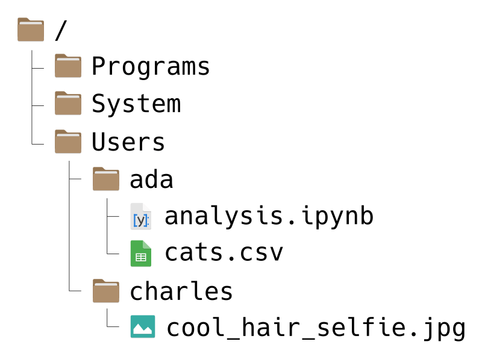

---
jupytext:
  formats: md:myst
  text_representation:
    extension: .md
    format_name: myst
kernelspec:
  display_name: Python 3
  language: python
  name: python3
---

```{code-cell}
:tags: [remove-cell]
import os

os.chdir("..")
```


Getting Started
===============

:::{admonition} Learning Objectives
* Run code in a Python console (in JupyterLab)
* Run and save code in a Jupyter notebook
* Create variables and call functions
* Create and access elements of lists
* Write paths to files and directories
* Get or set the Python working directory
* Identify the format of a data file
* Select appropriate functions for loading common file formats
:::

**[Python][]** is a popular general-purpose programming language. Python is also a
leading language for scientific computing due to the **[SciPy
ecosystem][SciPy]**, a collection of scientific computing software for Python.

[Python]: https://www.python.org/
[SciPy]: https://scipy.org/

The main way you'll interact with Python is by writing Python code or
**expressions**. Most people use "Python" as a blanket term to refer to both
the Python language and the Python software (which runs code written in the
language). Usually, the distinction doesn't matter, but it will be pointed out
if it does.

Code you write is **reproducible**: you can share it with someone else, and if
they run it with the same inputs, they'll get the same results. By writing
code, you create an unambiguous record of every step taken in your analysis.
This it one of the major advantages of Python and other programming languages
over point-and-click software like *Tableau* or *Microsoft Excel*. 

Another advantage of writing code is that it's often **reusable**. This means
you can:

* Automate repetitive tasks within an analysis
* Recycle code from one analysis into another
* Package useful code for distribution to your colleagues or the general
  public

At the time of writing, there were over 324,000 user-contributed packages
available for Python, spanning a broad range of disciplines.

Python is one of many programming languages used in data science. Compared to
other programming languages, Python's particular strengths are its:

* Interactivity
* Use in a wide variety of disciplines, not just data science
* Broad base of user-contributed packages
* Syntax which resembles pseudocode and encourages good habits


Prerequisites
-------------

Rather than installing Python directly, install **[Anaconda][]**, a collection
of free and open-source data science software. Anaconda includes three things
you'll need to follow along with this reader:

* Python 3
* SciPy ecosystem packages
* **[Conda][]**, a system for installing and managing software

You'll learn more about these later on. Anaconda also includes other popular
software, such as the R programming language. Install Anaconda by following
[this guide][anaconda-guide].

[Anaconda]: https://www.anaconda.com/
[Conda]: https://docs.conda.io/

[anaconda-guide]: https://ucdavisdatalab.github.io/install_guides/python-and-python-tools.html

In addition, you need to install **JupyterLab**. JupyterLab is an **integrated
development environment** (IDE), which means it's a comprehensive program for
writing, editing, searching, and running code. You can do all of these things
without JupyterLab, but JupyterLab makes the process easier. Install JupyterLab
by following [this guide][jupyterlab-guide].

[jupyterlab-guide]: https://ucdavisdatalab.github.io/install_guides/python-and-python-tools.html#jupyterlab

<!--
In addition to Anaconda, you'll need Visual Studio Code (VSCode). VSCode is an
*integrated development environment* (IDE), which means it's a comprehensive
program for writing, editing, searching, and running code. You can do all of
these things without VSCode, but VSCode makes the process easier. VSCode
supports a variety of programming languages, including Python, R, Java, C, and
C++. You can download Visual Studio Code for free [here][vscode], and can find
an install guide [here][vscode-guide].
[vscode]: https://code.visualstudio.com/Download
[vscode-guide]: TODO
-->


The Python Console
------------------

The first time you open JupyterLab, you'll see a window that looks like this:

```{image} ../img/jupyterlab_startup.png
:alt: The JupyterLab startup screen.
```

Don't worry if the text in the panes isn't exactly the same on your computer;
it depends on your operating system and version of JupyterLab.

Start by opening up a Python **console**. In JupyterLab, look for the "Python
3" button in the "Console" section of the pane on the right. If there are
multiple Python 3 buttons, click on the one that mentions "IPython" or
"ipykernel":

```{image} ../img/jupyterlab_console_button.png
:alt: The JupyterLab startup screen with the console button highlighted.
```

The console is a interactive, text-based interface to Python. If you enter a
Python expression in the console, Python will compute and display the result.
After you open the console, your window should look like this:

```{image} ../img/jupyterlab_console.png
:alt: A Python console running in JupyterLab.
```

At the bottom of the console, the text box beginning with `[ ]:` is called the
**prompt**. The prompt is where you'll type Python expressions. Ask Python to
compute the sum $2 + 2$ by typing the code `2 + 2` in the prompt and then
pressing `Shift`-`Enter`. Your code and the result from Python should look like
this:

```{image} ../img/jupyterlab_console_sum.png
:alt: A Python console running in JupyterLab, showing the sum of two numbers.
```

The Python console displays your code and the result on separate lines. Both
begin with the tag `[1]` to indicate that they are the first expression and
result. Python will increment the tag each time you run an expression. The tag
numbers will restart from 1 each time you open a new Python console.

Now try typing the code `3 - 1` in the prompt and pressing `Shift`-`Enter`:

```{image} ../img/jupyterlab_console_diff.png
:alt: A Python console running in JupyterLab, showing the difference of two numbers.
```

The tag on the code and result is `[2]`, and once again the result is displayed
after the tag.

Try out some other arithmetic in the Python console. Besides `+` for addition,
the other arithmetic operators are:

* `-` for subtraction
* `*` for multiplication
* `/` for division
* `%` for remainder division (modulo)
* `**` for exponentiation

You can combine these and use parentheses `( )` to make more complicated
expressions, just as you would when writing a mathematical expression. When
Python computes a result, it follows the standard order of operations:
parentheses, exponentiation, multiplication, division, addition, and finally
subtraction.

For example, to compute the area of a triangle with base 3 and height 4, you
can write:

```{code-cell}
0.5 * 3 * 4
```

You can write Python expressions with any number of spaces (including none)
around the operators and Python will still compute the result. As with writing
text, putting spaces in your code makes it easier for you and others to read,
so it's good to make it a habit. Put a single space on each side of most
operators, after commas, and after keywords. Later on, you'll learn about other
kinds of expressions where the spacing does matter.


### Variables

Python and most other programming languages allow you to create named values
called **variables**. You can create a variable with the assignment operator
`=` by writing a name on the left-hand side and a value or expression on the
right hand side. For example, to save the estimated area of the triangle in a
variable called `area`, you can write:

```{code-cell}
area = 3 * 4 / 2
```

In Python, variable names can contain any combination of letters, numbers, and
underscores `_`, but must always start with a letter. Spaces, dots, and other
symbols are not allowed in variable names.

The main reason to use variables is to temporarily save results from
expressions so that you can use them in other expressions. For instance, now
you can use the `area` variable anywhere you want the area of the triangle.

Notice that when you assign a result to a variable, Python doesn't
automatically display that result. If you want to see the result as well, you
have to enter the variable's name as a separate expression:

```{code-cell}
area
```

Another reason to use variables is to make an expression clearer and more
general. For instance, you might want to compute the area of several triangles
with different bases and heights. Then the expression `3 * 4 / 2` is too
specific.
Instead, you can create variables `base` and `height`, then rewrite the
expression as `base * height / 2`. This makes the expression easier to
understand, because the reader does not have to intuit that `3` and `4` are the
base and height in the formula. Here's the new code to compute and display the
area of a triangle with base 3 and height 4:

```{code-cell}
base = 3
height = 4
area = base * height / 2
area
```

Now if you want to compute the area for a different triangle, all you have to
do is change `base` and `height` and run the code again (Python will not update
`area` until you do this). Writing code that's general enough to reuse across
multiple problems can be a big time-saver in the long run. Later on, you'll see
ways to make this code even easier to reuse.


### Calling Functions

Python can do a lot more than just arithmetic. Most of Python's features are
provided through **functions**, pieces of reusable code. You can think of a
function as a machine that takes some inputs and uses them to produce some
output. In programming jargon, the inputs to a function are called
**arguments**, the output is called the **return value**, and using a function
is called **calling** the function.

To call a function, write its name followed by parentheses. Put any arguments
to the function inside the parentheses. For example, the function to round a
number to a specified decimal place is named `round`. So you can round the
number `8.153` to the nearest integer with this code:

```{code-cell}
round(8.153)
```

Many functions accept more than one argument. For instance, the `round` function
accepts two arguments: the number to round, and the number of decimal places to
keep. When you call a function with multiple arguments, separate the arguments
with commas. So to round `8.153` to 1 decimal place:

```{code-cell}
round(8.153, 1)
```

When you call a function, Python assigns the arguments to the function's
**parameters**. Parameters are special variables that represent the inputs to a
function and only exist while that function runs. For example, the `round`
function has parameters `number` and `ndigits`. The next section,
{numref}`getting-help`, explains how to look up the parameters for a function.

Some parameters have **default arguments**. A parameter is automatically
assigned its default argument whenever the parameter's argument is not
specified explicitly. As a result, assigning arguments to these parameters is
optional. For instance, the `ndigits` parameter of `round` has a default
argument (round to the nearest integer), so it is okay to call `round` without
setting `ndigits`, as in `round(8.153)`. In contrast, the `numbers` parameter
does not have a default argument. {numref}`getting-help` explains how to look
up the default arguments for a function.

Python normally assigns arguments to parameters based on their position. The
first argument is assigned to the function's first parameter, the second to the
second, and so on. So in the code above, `8.153` is assigned to `number` and
`1` is assigned to `ndigits`.

You can make Python assign arguments to parameters by name with `=`, overriding
their positions. So two other ways you can write the call above are:

```{code-cell}
round(8.153, ndigits = 1)
```

```{code-cell}
round(number = 8.153, ndigits = 1)
```

```{code-cell}
round(ndigits = 1, number = 8.153)
```

All of these are equivalent. When you write code, choose whatever seems the
clearest to you. Leaving parameter names out of calls saves typing, but
including some or all of them can make the code easier to understand.

Parameters are not regular variables, and only exist while their associated
function runs. You can't set them before a call, nor can you access them after
a call. So this code causes an error:

```{code-cell}
:tags: [raises-exception]
number = 4.755
round(ndigits = 2)
```

In the error message, Python says that you forgot to assign an argument to the
parameter `number`. You can keep the variable `number` and correct the call by
making `number` an argument (for the parameter `number`):

```{code-cell}
round(number, ndigits = 2)
```

Or, written more explicitly:

```{code-cell}
round(number = number, ndigits = 2)
```

The point is that variables and parameters are distinct, even if they happen to
have the same name. The variable `number` is not the same thing as the
parameter `number`.


### Objects & Attributes

Python represents data as **objects**. Numbers, strings, data structures, and
functions are all examples of objects.

An **attribute** is an object attached to another object. An attribute usually
contains metadata about the object to which it is attached. An attribute can
also be a function, in which case it is called a **method**.

For example, all strings have a `capitalize` method. You can access attributes
and methods by typing a `.` after an object. Here's the code to capitalize a
string:

```{code-cell}
"snakes everywhere!".capitalize()
```

The built-in `dir` function lists all of the attributes attached to
an object. Here are the attributes for a string:

```{code-cell}
dir("hi")
```

Attributes which begin with two underscores `__` are used by Python internally
and usually not intended to be accessed directly.


### Lists

A **list** is a container for zero or more values. The values in a list are
called **elements**, and the **length** of a list is the number of elements.
Lists are ordered, so there is a first element, second element, and so on up to
the length of the list.

You can make a list by enclosing comma-separated values in square brackets `[
]`, like this:

```{code-cell}
[1, 2, 3]
```

Lists can be empty:
```{code-cell}
[]
```

The elements of a list can also be qualitatively different. For instance,
here's a list where the first element is a number, the second is a string, and
the third is another list (with one element):

```{code-cell}
x = [8, "hello", ["a"]]
x
```

Square brackets `[ ]` also serve as the **indexing operator** in Python. The
indexing operator gets or sets an element of a list based on the element's
position. Python uses **zero-based indexing**, which means the first element of
a data structure is at position 0. The code to get the first element of the
list `x` is:

```{code-cell}
x[0]
```

Similarly, the code to get the third element of `x` is:

```{code-cell}
x[2]
```

You can set an element of a list by assigning at that index. So the code to
change the first element of `x` to the string `"hi"` is:

```{code-cell}
x[0] = "hi"
x
```

Notice that this changes the overall list.

You can get the length of a list with the built-in `len` function:

```{code-cell}
len(x)
```

Lists are a fundamental data structure in Python, so you'll see many more
examples of them as you go through this reader.


### References

When you assign a Python object to a variable, Python usually creates a
**reference** to the object. This means that if you assign an object to
multiple variables and change one, all of them will change.

For example, suppose you assign a list to variables `x` and `y`, then change an
element of `y`. Doing so also changes `x`:

```{code-cell}
x = [1, 2]
y = x
y[0] = 10
x
```

If you want to make a copy of an object, use the object's `copy` method:

```{code-cell}
x = [1, 2]
y = x.copy()
y[0] = 10
x
```

Reassigning a variable, as opposed to modifying elements, does not affect other
variables. Here's an example:

```{code-cell}
x = 3
y = x
y = 4
x
```


(getting-help)=
Getting Help
------------

Learning and using a language is hard, so it's important to know how to get
help. The first place to look for help is Python's built-in documentation. In
the console, you can access the help pages with the `help` function.

There are help pages for all of Python's built-in functions, usually with the
same name as the function itself. So the code to open the help page for the
`round` function is:

```{code-cell}
help(round)
```

For functions, help pages usually include a brief description and a list of
parameters and default arguments. For instance, the help page for `round` shows
that there are two parameters `number` and `ndigits`. It also says that
`ndigits=None`, meaning the default argument for `ndigits` is the special
`None` value, which you'll learn more about in TODO.

There are also help pages for other topics, such as built-in operators and
modules (you'll learn more about modules in {numref}`modules-packages`). To
look up the help page for an operator, put the operator's name in single or
double quotes. 

Python treats anything inside single or double quotes as literal text rather
than as an expression to evaluate. In programming jargon, a piece of literal
text is called a **string**. You can use whichever kind of quotes you prefer,
but the quote at the beginning of the string must match the quote at the end. 

For example, this code opens the help page for the arithmetic operators:

```{code-cell}
help("+")
```

It's always okay to put quotes around the name of the page when you use `help`,
but they're only required if the name contains non-alphabetic characters. So
`help(abs)`, `help('abs')`, and `help("abs")` all open the documentation for
`abs`, the absolute value function.

You can also browse the Python documentation [online][pydocs]. This is a good
way to explore the many different functions and data structures built into
Python. If you do use the online documentation, make sure to use the
documentation for the same version of Python as the one you have. Python
displays the version each time you open a new console, and the online
documentation shows the version in the upper left corner.

[pydocs]: https://docs.python.org/3/

Sometimes you might not know the name of the help page you want to look up. In
that case it's best to use an online search engine. When you search for help
with Python online, include "Python" as a search term.


### When Something Goes Wrong

As a programmer, sooner or later you'll run some code and get an error message
or result you didn't expect. Don't panic! Even experienced programmers make
mistakes regularly, so learning how to diagnose and fix problems is vital.

Try going through these steps:

1. If Python printed a warning or error message, read it! If you're not sure
   what the message means, try searching for it online.
2. Check your code for typographical errors, including incorrect
   capitalization, whitespace, and missing or extra commas, quotes, and
   parentheses.
3. Test your code one line at a time, starting from the beginning. After each
   line that assigns a variable, check that the value of the variable is what
   you expect. Try to determine the exact line where the problem originates
   (which may differ from the line that emits an error!).

If none of these steps help, try asking online. [Stack Overflow][stacko] is a
popular question and answer website for programmers. Before posting, make sure
to read about [how to ask a good question][goodq].

[stacko]: https://stackoverflow.com/
[goodq]: https://stackoverflow.com/help/how-to-ask


(modules-packages)=
Packages
--------

A **package** is a reusable bundle of code. Packages usually include
documentation, and can also contain examples and data sets. Most packages are
developed by members of the Python community, so quality varies. 


### The SciPy Ecosystem

The SciPy ecosystem is a collection of scientific computing software for Python
introduced in 2001. SciPy is divided into several different Python packages.

Some of the most important packages in the SciPy ecosystem are:

* **NumPy**, which provides an n-dimensional array data structure and a variety
  of math functions
* **SciPy**, which provides additional math functions
* **Pandas**, which provides data frames
* **IPython**, which makes it possible to run Python code in Jupyter
* **Matplotlib**, which provides data visualization functions

You'll learn much more about NumPy, SciPy, and Pandas as you go through this
reader. By using JupyterLab, you've already used IPython. You'll use Matplotlib
indirectly later on, when you learn about visualization.


### Modules

In Python, packages are further subdivided into **modules**, collections of
related functions and data structures. The best way to learn about the modules
provided by a package is to read the package's documentation. There are also
many modules that are built into Python, to provide extra features.

Most packages have a main module with the same name as the package. So the
NumPy package provides a module called `numpy`, and the Pandas package provides
a module called `pandas`. You can use the `import` command to load a module
from an installed package. Anaconda installs NumPy by default, so try loading
the `numpy` module:

```{code-cell}
import numpy
```

A handful of modules print out a message when loaded, but the vast majority do
not. Thus you can assume the `import` command was successful if nothing is
printed. If something goes wrong while loading a module, Python will print out
an error message explaining the problem.

Once a module is loaded, you can access its functions by typing the name of the
module, a dot `.`, and then the name of the function. For instance, to use the
`round` function provided by NumPy:

```{code-cell}
numpy.round(3.3)
```

Typing the full name of a module is inconvenient, so the `import` command
allows you to define an alias when you import a module. For popular packages,
there's usually a conventional alias for the main module. The conventional
alias for `numpy` is `np`. Using the conventional alias is a good habit,
because it makes it easier for other people to understand your code. Use the
`as` keyword to set an alias when you import a module:

```{code-cell}
import numpy as np
```

Now you can call NumPy functions by typing `np` instead of `numpy`:

```{code-cell}
np.round(3.4)
```

Note that NumPy's `np.round` is an entirely different function than Python's
built-in `round` function, even though they do the same thing. NumPy's math
functions are generally faster, more precise, and more convenient than Python's
built-in math functions.


File Systems
------------

_TODO: Remake image to be Python appropriate or language agnostic._

Most of the time, you won't just write code directly into the Python console.
Reproducibility and reusability are important benefits of Python over
point-and-click software, and in order to realize these, you have to save your
code to your computer's hard drive. Let's start by reviewing how files on a
computer work. You'll need to understand that before you can save your code,
and it will also be important later on for loading data sets.

Your computer's _file system_ is a collection of _files_ (chunks of data) and
_directories_ (or "folders") that organize those files. For instance, the file
system on a computer shared by [Ada][ada] and [Charles][chuck], two pioneers of
computing, might look like this:

[ada]: https://en.wikipedia.org/wiki/Ada_Lovelace
[chuck]: https://en.wikipedia.org/wiki/Charles_Babbage



Don't worry if your file system looks a bit different from the picture.

File systems have a tree-like structure, with a top-level directory called the
_root directory_. On Ada and Charles' computer, the root is called `/`, which
is also what it's called on all macOS and Linux computers. On Windows, the root
is usually called `C:/`, but sometimes other letters, like `D:/`, are also used
depending on the computer's hardware.

A _path_ is a list of directories that leads to a specific file or directory on
a file system (imagine giving directions to someone as they walk through the
file system). Use forward slashes `/` to separate the directories in a path,
rather than commas or spaces. The root directory includes a forward slash as
part of its name, and doesn't need an extra one.

For example, suppose Ada wants to write a path to the file `cats.csv`. She can
write the path like this:

```
/Users/ada/cats.csv
```

You can read this path from left-to-right as, "Starting from the root
directory, go to the `Users` directory, then from there go to the `ada`
directory, and from there go to the file `cats.csv`." Alternatively, you can
read the path from right-to-left as, "The file `cats.csv` inside of the `ada`
directory, which is inside of the `Users` directory, which is in the root
directory."

As another example, suppose Charles wants a path to the `Programs` directory.
He can write:

```
/Programs/
```

The `/` at the end of this path is reminder that `Programs` is a directory, not
a file. Charles could also write the path like this:

```
/Programs
```

This is still correct, but it's not as obvious that `Programs` is a directory.
In other words, when a path leads to a directory, including a _trailing slash_
is optional, but makes the meaning of the path clearer. Paths that lead to
files never have a trailing slash.

_TODO: Python doesn't use / for all OSes_

On Windows computers, paths are usually written with backslashes ```\``` to
separate directories instead of forward slashes. Fortunately, R uses forward
slashes `/` for all paths, regardless of the operating system. So when you're
working in R, use forward slashes and don't worry about the operating system.
This is especially convenient when you want to share code with someone that
uses a different operating system than you.


(absolute-relative-paths)=
### Absolute & Relative Paths

A path that starts from the root directory, like all of the ones we've seen so
far, is called an _absolute path_. The path is "absolute" because it
unambiguously describes where a file or directory is located. The downside is
that absolute paths usually don't work well if you share your code.

For example, suppose Ada uses the path `/Programs/ada/cats.csv` to load the
`cats.csv` file in her code. If she shares her code with another pioneer of
computing, say [Gladys][gladys], who also has a copy of `cats.csv`, it might
not work. Even though Gladys has the file, she might not have it in a directory
called `ada`, and might not even have a directory called `ada` on her computer.
Because Ada used an absolute path, her code works on her own computer, but
isn't portable to others.

[gladys]: https://en.wikipedia.org/wiki/Gladys_West

On the other hand, a _relative path_ is one that doesn't start from the root
directory. The path is "relative" to an unspecified starting point, which
usually depends on the context.

For instance, suppose Ada's code is saved in the file `analysis.ipynb` (more
about `.ipynb` files in {numref}`jupyter-notebooks`), which is in the same
directory as `cats.csv` on her computer. Then instead of an absolute path, she
can use a relative path in her code:

```
cats.csv
```

The context is the location of `analysis.ipynb`, the file that contains the code.
In other words, the starting point on Ada's computer is the `ada` directory. On
other computers, the starting point will be different, depending on where the
code is stored.

Now suppose Ada sends her corrected code in `analysis.ipynb` to Gladys, and
tells Gladys to put it in the same directory as `cats.csv`. Since the path
`cats.csv` is relative, the code will still work on Gladys' computer, as long
as the two files are in the same directory. The name of that directory and its
location in the file system don't matter, and don't have to be the same as on
Ada's computer. Gladys can put the files in a directory
`/Users/gladys/from_ada/` and the path (and code) will still work.

Relative paths can include directories. For example, suppose that Charles wants
to write a relative path from the `Users` directory to a cool selfie he took.
Then he can write:

```
charles/cool_hair_selfie.jpg
```

You can read this path as, "Starting from wherever you are, go to the `charles`
directory, and from there go to the `cool_hair_selfie.jpg` file." In other
words, the relative path depends on the context of the code or program that
uses it.

When use you paths in code, they should almost always be relative paths. This
ensures that the code is portable to other computers, which is an important
aspect of reproducibility. Another benefit is that relative paths tend to be
shorter, making your code easier to read (and write).

When you write paths, there are three shortcuts you can use. These are most
useful in relative paths, but also work in absolute paths:

* `.` means the current directory.
* `..` means the directory above the current directory.
* `~` means the _home directory_. Each user has their own home directory, whose
  location depends on the operating system and their username. Home directories
  are typically found inside `C:/Users/` on Windows, `/Users/` on macOS, and
  `/home/` on Linux.

As an example, suppose Ada wants to write a (relative) path from the `ada`
directory to Charles' cool selfie. Using these shortcuts, she can write:

```
../charles/cool_hair_selfie.jpg
```

Read this as, "Starting from wherever you are, go up one directory, then go to
the `charles` directory, and then go to the `cool_hair_selfie.jpg` file." Since
`/Users/ada` is Ada's home directory, she could also write the path as:

```
~/../charles/cool_hair_selfie.jpg
```

This path has the same effect, but the meaning is slightly different. You can
read it as "Starting from your home directory, go up one directory, then go to
the `charles` directory, and then go to the `cool_hair_selfie.jpg` file."

The `..` and `~` shortcut are frequently used and worth remembering. The `.`
shortcut is included here in case you see it in someone else's code. Since it
means the current directory, a path like `./cats.csv` is identical to
`cats.csv`, and the latter is preferable for being simpler. There are a few
specific situations where `.` is necessary, but they fall outside the scope of
this text.


(jupyter-notebooks)=
### Jupyter Notebooks


### The Working Directory

{numref}`absolute-relative-paths` explained that relative paths have a
starting point that depends on the context where the path is used. The _working
directory_ is the starting point Python uses for relative paths. Think of the
working directory as the directory Python is currently "at" or watching.


Reading Files
-------------

The first step in most data analyses is loading the data. The Pandas package
provides functions to read a variety of data formats. In order to know which
function to use, you need to identify the data's file format.

Most of the time, you can guess the format of a file by looking at its
**extension**, the characters (usually three) after the last dot `.` in the
filename. For example, the extension `.jpg` or `.jpeg` indicates a [JPEG image
file][jpg]. Some operating systems hide extensions by default, but you can find
instructions to change this setting online by searching for "show file
extensions" and your operating system's name. The extension is just part of the
file's name, so it should be taken as a hint about the file's format rather
than a guarantee.

[jpg]: https://en.wikipedia.org/wiki/JPEG

The table below shows several formats that are frequently used to distribute
data. Although Pandas provides reader functions for all of these, the lxml
package and Python's built-in json module are better suited to the last two.

| Name                        | Extension  | Tabular?  | Text? | Pandas Function
| :-------------------------- | :--------  | :-------- | :---- | :--------------
| Comma-separated Values      | `.csv`     | Yes       | Yes   | `read_csv`
| Tab-separated Values        | `.tsv`     | Yes       | Yes   | `read_table`
| Fixed-width File            | `.fwf`     | Yes       | Yes   | `read_fwf`
| Microsoft Excel             | `.xlsx`    | Yes       | No    | `read_excel`
| [Apache Arrow][arrow]       | `.feather` | Yes       | No    | `read_feather`
| Extensible Markup Language  | `.xml`     | No        | Yes   | Use lxml package
| JavaScript Object Notation  | `.json`    | No        | Yes   | Use json module

[arrow]: https://arrow.apache.org/

A **tabular** data set is one that's structured as a table, with rows and
columns. We'll focus on tabular data sets for most of this reader, since
they're easier to get started with. Here's an example of a tabular data set:

| Fruit  | Quantity | Price
| :----  | -------: | ----:
| apple  | 32       | 1.49
| banana | 541      | 0.79
| pear   | 10       | 1.99

A **text** file is one that contains human-readable lines of text. You can
check this by opening the file with a text editor such as Microsoft Notepad or
macOS TextEdit. Many file formats use text in order to make the format easier
to work with.

For instance, a **comma-separated values** (CSV) file records a tabular data
using one line per row, with commas separating columns. If you store the table
above in a CSV file and open the file in a text editor, here's what you'll see:

```
Fruit,Quantity,Price
apple,32,1.49
banana,541,0.79
pear,10,1.99
```

A **binary** file is one that's not human-readable. You can't just read off the
data if you open a binary file in a text editor, but they have a number of
other advantages. Compared to text files, binary files are often faster to read
and take up less storage space (bytes).


### Hello, Data!

Over the next few sections, you'll explore data from [The Trust for Public
Land][tpl] about park access in major American cities. The data set was
prepared as part of the Tidy Tuesday community data project. You can find more
details about the data set [here][parks], and you can download the data set
[here][parks-dl] (you may need to choose `File -> Save As...` in your browser's
menu).

[tpl]: https://www.tpl.org/parks-and-an-equitable-recovery-parkscore-report
[parks]: https://github.com/rfordatascience/tidytuesday/tree/master/data/2021/2021-06-22
[parks-dl]: https://raw.githubusercontent.com/ucdavisdatalab/workshop_python_basics/main/data/parks_final.csv

The data set is a file called `parks_final.csv`, which suggests it's a CSV
file. In this case, the extension is correct, so you can read the file with
Pandas' `read_csv` function. The first argument is the path to where you saved
the file, which may be different on your computer. The `read_csv` function
returns the data set, but Python won't keep the data in memory unless you
assign the returned result to a variable:

```{code-cell}
import pandas as pd

parks = pd.read_csv("data/parks_final.csv")
parks
```

The variable name `parks` here is arbitrary; you can choose something different
if you want. However, in general, it's a good habit to choose variable names
that describe the contents of the variable somehow.

If you tried running the line of code above and got an error message, pay
attention to what the error message says, and remember the strategies to get
help in {numref}`getting-help`. The most common mistake when reading a file is
incorrectly specifying the path, so first check that you got the path right.

If you ran the line of code, there was no error message, and you can see a
table of data, then congratulations, you've read your first data set into
Python! The next session will pick up from this point and introduce the basics
of inspecting a data set.
